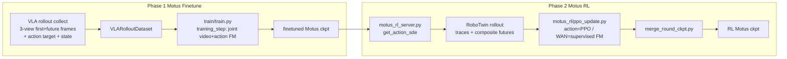

# Motus — single-version, two-phase plan

One codebase, two phases. No legacy codenames (no WRM / WAM-warmup / SDEdit-refine
/ residual / Tier / v1–v4). This is the authoritative design doc.

- **Phase 1 — Motus finetune**: use VLA success trajectories to finetune Motus
  with its **native joint training** (video branch + action branch together).
  Equivalent to a normal WAM finetune.
- **Phase 2 — Motus RL**: isolated training — the **action expert** is updated by
  **PPO** on Flow-SDE denoise log-probs, while the **video (WAN) branch** is
  supervised by **flow-matching on the future frames observed during RL rollouts**.
  Gradients never mix (see `motus_rl/ppo_update.py`).



## Key design

- **Freezing (both phases, Motus-native)**: VLM (Qwen3-VL), VAE and T5 are frozen;
  WAN video diffusion + action expert + und expert are trained
  (`models/motus.py` VLM frozen; `train/train.py` gives WAN a separate lr).
- **Phase 1 training entry = native** `train/train.py` + `training_step`
  (`models/motus.py`, already joint video+action). No training-logic changes —
  only a new dataset (`data/vla_rollout_dataset.py`).
- **Phase 2 learner** = `motus_rl/ppo_update.py` (action PPO + `video_supervised_loss`
  on observed futures). Rollouts come from `deploy/motus_rl_server.py`.
- **3-view composite** = the exact `MotusPolicy.update_obs` layout: head on top,
  left|right (each resized to 160×120) below, then `resize_with_padding` to
  `(video_height, video_width) = (384, 320)`. Built at train time from raw views.
- **Video grid** = within a chunk, future frame `i` is at executed raw step
  `(i+1) * video_action_freq_ratio * global_downsample_rate`
  → `[6,12,...,48]` for `num_video_frames=8, ratio=2, ds=3`.
- **Action target** = VLA chunk resampled on the Motus grid: index
  `(i+1)*ds - 1` → 16 steps of raw qpos.

## Data format (collected by `RoboTwin/script/rl_rollout_worker.py`)

One npz per successful VLA episode, at `<rl_root>/<task>/round0/traj/*.npz`:

| key | shape / dtype | meaning |
|-----|---------------|---------|
| `cam_high/left/right` | `[n_chunk,H,W,3] uint8` | chunk first frame, 3 raw views |
| `future_high/left/right` | `[n_chunk,8,H,W,3] uint8` | future frames, 3 raw views (grid `[6..48]`) |
| `state` | `[n_chunk,14] float32` | raw qpos (Motus joint order) |
| `target` | `[n_chunk,16,14] float32` | VLA action, stride-`ds` → Motus grid |
| `instruction` | str | task instruction (raw; scene prefix added at encode time) |

## Phase 1 — run

```bash
# 1) collect (lingbot-vla env for VLA server, RoboTwin env for worker)
cd lingbot-vla
RL_ROOT=/path/motus_v1 TARGET_SUCCESS=100 NUM_SEEDS=180 bash scripts/collect_motus_v1.sh

# 2) pre-encode instructions -> lang_cache.pt (motus env; UMT5-xxl)
cd Motus
python scripts/build_lang_cache.py --dataset_dir /path/motus_v1 --wan <WAN_PATH>

# 3) set dataset.dataset_dir + finetune.checkpoint_path in configs/motus_finetune.yaml, then:
bash scripts/train_finetune.sh

# 4) convert a training checkpoint to deploy format
python scripts/convert_finetune_to_deploy.py \
    --in checkpoints_motus_finetune/checkpoint_step_50000 \
    --out deploy_ckpts/motus_finetune
```

## Phase 2 — run

```bash
# closed loop: server -> rollout -> ppo_update -> merge (per round)
cd lingbot-vla
BASE_CKPT=/path/Motus/deploy_ckpts/motus_finetune \
WAN_PATH=<WAN> VLM_PATH=<Qwen3-VL> TASKS="stack_blocks_three" NUM_ROUNDS=3 \
  bash scripts/run_motus_rl.sh
```

## Component map

| concern | file |
|---------|------|
| Model (train + inference) | `models/motus.py` — `training_step`, `inference_step` (Euler), `sample_actions_sde`, `action_logprob_from_trace`, `video_supervised_loss` |
| Phase 1 dataset | `data/vla_rollout_dataset.py` (+ `data/dataset.py` type `vla_rollout`) |
| Phase 1 config / launch | `configs/motus_finetune.yaml`, `scripts/train_finetune.sh` |
| Lang cache | `scripts/build_lang_cache.py` |
| Ckpt convert | `scripts/convert_finetune_to_deploy.py` |
| Phase 2 learner | `motus_rl/ppo_update.py`, `motus_rl/reward.py` |
| Phase 2 round merge | `motus_rl/merge_round_ckpt.py` |
| Phase 2 server | `lingbot-vla/deploy/motus_rl_server.py` |
| Phase 2 rollout | `RoboTwin/script/motus_rl_rollout_worker.py` |
| Phase 2 orchestration | `lingbot-vla/scripts/run_motus_rl.sh` |
| Data collection | `RoboTwin/script/rl_rollout_worker.py`, `lingbot-vla/scripts/collect_motus_v1.sh` |
| Deploy / eval | `inference/robotwin/Motus/deploy_policy.py` — `get_action`, `get_action_sde` |

## Notes

- Both `models/motus.py` copies (root training / inference deploy) keep an identical
  `training_step` so Phase-2 `video_supervised_loss` matches Phase-1 training.
- `ppo_update.py` saves only the action+und params it trains; use
  `merge_round_ckpt.py` to overlay them onto the base deploy ckpt for the next round.
